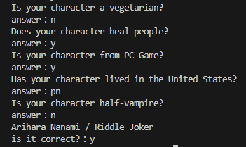

# Akinator-python
A API wrapper for the AkinatorAPI
### >>```pip install akinator-python```<<
## Usage
Install this module, download example.py and run  
#### example.py
```py
from akinator_python import Akinator

akinator=Akinator(lang="en")
print(akinator.start_game())
while True:
    ans=input("answer：")
    if ans=="b":
        print(akinator.go_back()['question'])
    else:
        response=akinator.post_answer(ans)
        if "id_proposition" in response:
            print(f"{response['name_proposition']} / {response['description_proposition']}")
            ans=input("is it correct?：")
            if ans=="n":
                print(akinator.exclude()['question'])
            elif ans=="y":
                break
        else:
            print(response['question'])
```
I have prepared a super simple example code  
You can just run and enjoy it in terminal :)  
  
## Know a little more
```Akinator()```  
- You can set language, theme, child mode in arguments  
- ```language=str```, The endpoint URL is determined based on this argument  
  If nothing is specified, ```lang=jp``` Japanese will be selected  
- ```theme=str```, ```characters``` or ```objects``` or ```animals```  
  If nothing is specified, ```theme=characters``` characters will be selected
- ```child_mode=bool```  
  default is ```False```
  
```Akinator.post_answer()```  
- ```answer=str```  
  Answers are Yes : ```y``` No : ```n``` I don't know : ```idk``` probably : ```p``` probably not : ```pn```
- it will return a dict
  ```
  {'completion': 'OK', 'akitude': 'serein.png', 'step': '1', 'progression': '0.00000',
   'question_id': '464', 'question': 'Is your character a girl?'}
  ```
  
```Akinator.go_back()```  
- Yes, you can go back to the previous question

```Akinator.exclude()```  
- If Akinator's answer is incorrect, you can restart the question
### When Akinator makes a guess
```
{'completion': 'OK', 'id_proposition': '309720', 'id_base_proposition': '10657795', 'valide_contrainte': '1',
 'name_proposition': 'Arihara Nanami', 'description_proposition': 'Riddle Joker', 
 'flag_photo': '2', 'photo': 'https://photos.clarinea.fr/BL_2_en/600/partenaire/p/10657795__894179331.png', 'pseudo': 'MrSand', 'nb_elements': 1}
```
It will return the character name, image URL and more  
## Contacts  
Discord server / https://discord.gg/aSyaAK7Ktm  
Discord username / .taka.  
