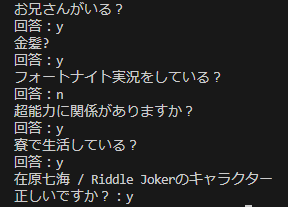

# Akinator-python
AkinatorAPI ラッパー！
### >>```pip install akinator-python```<<
## 必要なモジュール
- requests
- bs4
## 使い方
モジュールをインストールしてexample_jaを実行します  
#### example_ja.py
```py
from akinator_python import Akinator

akinator=Akinator()
akinator.start_game()
while True:
    try:
        print(akinator.question)
        ans=input("回答：")
        if ans=="b":
            akinator.go_back()
        else:
            akinator.post_answer(ans)
            if akinator.answer_id:
                print(f"{akinator.name} / {akinator.description}")
                ans=input("正しいですか？：")
                if ans=="n":
                    akinator.exclude()
                elif ans=="y":
                    break
                else:
                    break
    except Exception as e:
        print(e)
        continue
```
Akinator-pythonを使う必要最低限のコードです  
ターミナルで実行して結果を見ることができます  
  
## もう少し知る
```Akinator()```  
- 引数に言語、テーマ、チャイルドモードを設定できます  
- ```language=str```, この引数からエンドポイントのURLが決まります  
  なにも入れないと ```lang=jp``` で日本語が選択されます  
- ```theme=str```, ```characters``` or ```objects``` or ```animals```  
  テーマはデフォルトで ```theme=characters``` キャラクターが選ばれます
- ```child_mode=bool```  
  デフォルトは ```False```

```Akinator.start_game()```  
- アキネーターをスタートします  
  ゲームが始まると最初の質問がstrで返ってきます
  
```Akinator.post_answer()```  
- ```answer=str```  
  回答は はい : ```y``` いいえ : ```n``` わからない : ```idk``` たぶんそう : ```p``` たぶん違う : ```pn``` の中から選びます
  
```Akinator.go_back()```  
- 1つ前の質問に戻ります

```Akinator.exclude()```  
- アキネーターの出した答えが間違っている場合、質問を再開できます

```Akinator.step```  
- 常に ```int``` 質問の数を確認できます

```Akinator.progression```  
- 常に ```float``` アキネーターの推測の進行状況

```Akinator.question```  
- 常に ```str```, ふつうに質問

## アキネーターが答えを出した時
```Akinator.name```  
- デフォルトは ```None``` アキネーターがなにか答えを出したら ```str``` でキャラクターの名前

```Akinator.description```  
- ```.name``` と同じ仕様でキャラクターの説明

```Akinator.photo```  
- ```.name``` と同じ仕様でキャラクターの写真のURL
## 補足
```.post_ansewer()``` ```.go_back()``` ```.exclude()``` はdictを返します  
#### 質問が進行中
```
{'completion': 'OK', 'akitude': 'serein.png', 'step': '1', 'progression': '0.00000',
 'question_id': '464', 'question': 'Is your character a girl?'}
```
#### アキネーターが答えを出した時
```
{'completion': 'OK', 'id_proposition': '309720', 'id_base_proposition': '10657795', 'valide_contrainte': '1',
 'name_proposition': 'Arihara Nanami', 'description_proposition': 'Riddle Joker', 
 'flag_photo': '2', 'photo': 'https://photos.clarinea.fr/BL_2_en/600/partenaire/p/10657795__894179331.png', 'pseudo': 'MrSand', 'nb_elements': 1}
```
## コンタクト  
Discord サーバー / https://discord.gg/aSyaAK7Ktm  
Discord ユーザー名 / .taka.  
